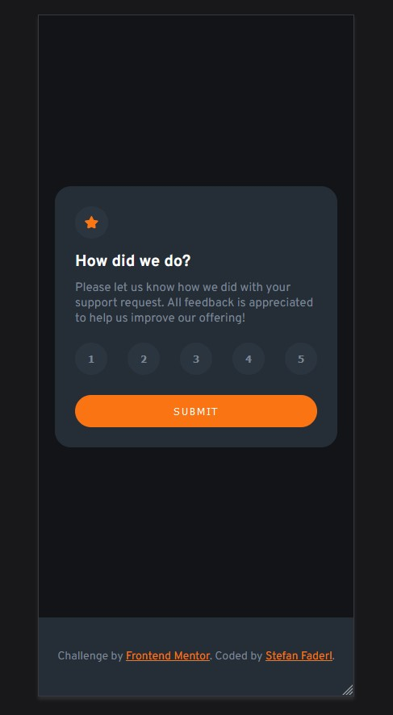

## Welcome! 👋

# Frontend Mentor - Interactive rating component solution

This is a solution to the [Interactive rating component challenge on Frontend Mentor](https://www.frontendmentor.io/challenges/interactive-rating-component-koxpeBUmI).

## Table of contents

- [Overview](#overview)
  - [The challenge](#the-challenge)
  - [Screenshot](#screenshot)
  - [Links](#links)
- [Author](#author)

## Overview

### The challenge

Users should be able to:

- View the optimal layout for the app depending on their device's screen size
- See hover states for all interactive elements on the page
- Select and submit a number rating
- See the "Thank you" card state after submitting a rating

### Screenshot

### Links

- Live Site URL: [See live site](https://sf-interactive-rating-component.netlify.app/)

## Author

- Website - [My portfolio](https://stefanfaderl.github.io/)
- Frontend Mentor - [@stefanfaderl](https://www.frontendmentor.io/profile/stefanfaderl)

[Frontend Mentor](https://www.frontendmentor.io) challenges help you improve your coding skills by building realistic projects.
